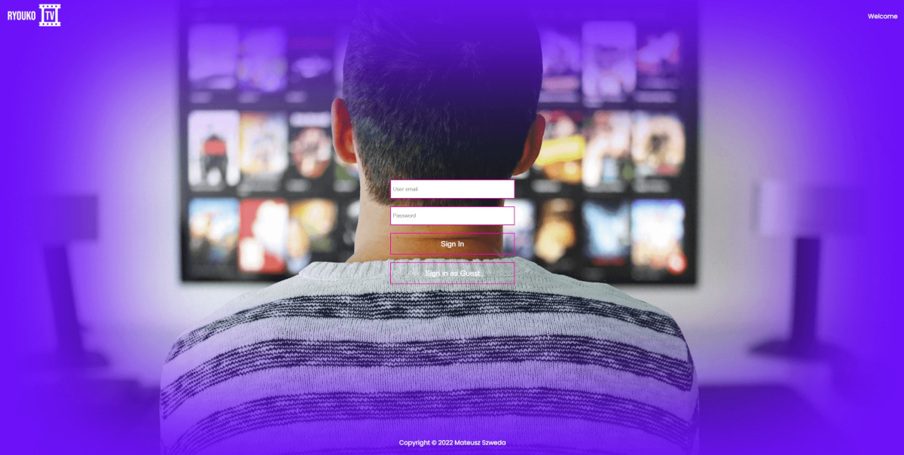

# RyoukoTV

RyoukoTV is over-the-top application that delievers video content to your devicce. RyoukoTV it was my interview task for Better Software Group. For styling I used preprocessor Sass. For video handle I used react-player by cookpete.

## See it live

-   [GitHub](https://github.com/mate966/ott-web-app)

## Built With

-   [REACT](https://reactjs.org/)
-   [SASS](https://sass-lang.com/)
-   [Splide](https://splidejs.com/) - Slider
-   [Redux-Toolit](https://redux-toolkit.js.org/) - Redux Toolkit with redux-persist to keep data on storage
-   [React-player](https://github.com/cookpete/react-player) - React component for playing a variety of URLs.

## Author

-   **Mateusz Szweda** - [Mate](https://github.com/mate966)
-   **Better Software Group API** - [Better Software Group](https://www.bsgroup.eu/)
